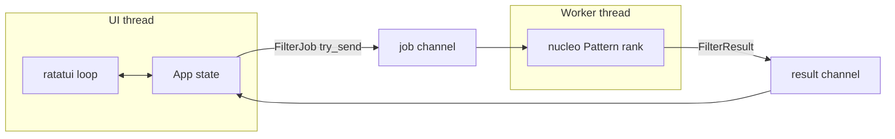

# agentos

Side project: a **terminal-first tool navigator** with a thin **agent command harness**, written as a foundation for a larger “agentic terminal OS” idea (fuzzy discovery, pluggable agents, later: attestable journals and declarative trust boundaries).

This crate is intentionally small and shippable: it runs today, has a clean module split, and is meant to be **forked or grown** into the next phase without rewriting everything.

## What works today

- **ratatui** UI: list + preview, mode chrome, resize-aware layout
- **nucleo-matcher** fuzzy ranking on a **background worker thread** (crossbeam channels), with **epoch-based** stale-result dropping so fast typing does not flash old rankings
- **Graceful worker shutdown**: dropping the job sender ends the worker loop; `run()` **joins** the filter thread before restoring the terminal
- **Panic hook** (`panic_hook.rs`): disables raw mode, leaves alternate screen, disables mouse capture, shows cursor — then chains the previous hook
- **Dual mode**: Search (filter tools) vs Agent (`/help`, `/echo`, `/quit`) with Tab / Esc semantics
- **Mouse**: wheel scroll + click-to-select inside the list (keyboard parity for navigation)
- **Debouncing**: filter requests and terminal resize
- **Append-only in-memory event log** (`AppEvent`) plus a **`Journal` trait** implemented by `EventLog` (swap-in point for disk / Merkle / hash-chained logs)
- **Stable `ToolId`** through filter changes (selection reconciles by id, not raw index)
- **`Agent` trait + `AgentRegistry`**: built-ins are structs (`HelpAgent`, `EchoAgent`, `QuitAgent`) with `id()` and `command()` — add a new agent by registering one implementation
- **Boundary stubs** (`boundary.rs`): `ContentHash`, `Signature`, `AgentId`, `ToolManifest`, `VerificationReport`, `verify_tool_stub`, **`StateStore` trait** + `MemoryStateStore` (used on tool pick + `get` round-trip in UI copy)
- **`unsafe_code = "forbid"`** via package lints in `agentos/Cargo.toml`

## Repository layout

The Rust workspace lives at the **repo root** (`Cargo.toml` + `Cargo.lock`). This package is the only member for now.

```text
Cargo.toml              # [workspace] members = ["agentos"]
Cargo.lock
rust-toolchain.toml     # stable + rustfmt + clippy (CI aligns with this)
agentos/
  Cargo.toml
  README.md
  src/
    main.rs             # panic hook + entry → app::run
    app.rs              # event loop, debounce, input routing, Journal logging
    ui.rs               # layout + render + LayoutCache for hit-testing
    model.rs            # Tool, ToolId, InputMode, AppLayer
    events.rs           # AppEvent, EventLog, trait Journal
    boundary.rs         # trust/store types + StateStore + verify stubs
    panic_hook.rs       # terminal restore on panic
    worker.rs             # FilterWorker + FilterJob / FilterResult + join
    agent_harness.rs    # trait Agent + AgentRegistry + built-ins
    tools.rs            # built-in demo corpus
```

## Run

From repository root:

```bash
cargo run -p agentos
```

Develop:

```bash
cargo fmt --all
cargo clippy --workspace --all-targets --locked -- -D warnings
cargo test --workspace --locked
```

CI (when this tree is on the default branch and workflows are active) runs the same checks under `.github/workflows/agentos-ci.yml`.

## Architecture sketch



Design intent: **the TUI thread never blocks on matching**. Execution of real tools is still deliberately not wired (Enter records pick + manifest/verify stub + `StateStore`); subprocess and network I/O belong behind a worker/runtime boundary in a later iteration.

## Review coverage (this crate vs roadmap)

| Review theme | Status in-tree |
|--------------|----------------|
| Panic hook + terminal restore | Done (`panic_hook.rs`) |
| Graceful worker shutdown (join) | Done (`FilterWorker::shutdown`) |
| `Journal` trait (audit boundary) | Done (`events.rs`) |
| `StateStore` + boundary types | Done (`boundary.rs`, wired on pick) |
| `Agent` trait + registry | Done (`agent_harness.rs`) |
| View / focus stack (`trait View`) | Not done — next structural refactor |
| Tokio + split control/work channels | Not done — still `std::thread` + crossbeam |
| `nucleo::Nucleo` incremental matcher | Not done — still `nucleo-matcher` per job |

## Roadmap (suggested order)

1. **View / focus stack** — one dispatcher over a stack of `View`s; shrink `App` input routing.
2. **Tokio worker** — `current_thread` runtime (or dedicated async thread), split control vs data channels, cancellation tokens.
3. **`nucleo::Nucleo`** — snapshot/incremental fuzzy pipeline; tests for ranking + staleness.
4. **Real hashing / signing** — replace `ContentHash::PLACEHOLDER`, populate `Signature`, seal `ToolManifest`.

## License

Workspace default in root `Cargo.toml` is `MIT OR Apache-2.0`; confirm and adjust before publishing if this repo uses a different policy.
