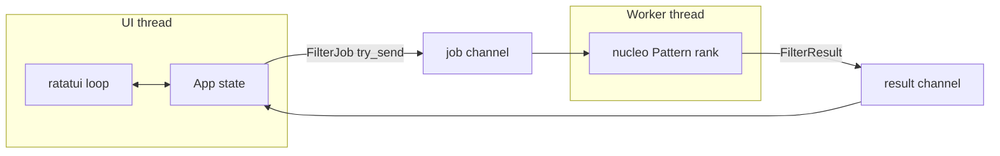

# agentos

Side project: a **terminal-first tool navigator** with a thin **agent command harness**, written as a foundation for a larger “agentic terminal OS” idea (fuzzy discovery, pluggable agents, later: attestable journals and declarative trust boundaries).

This crate is intentionally small and shippable: it runs today, has a clean module split, and is meant to be **forked or grown** into the next phase without rewriting everything.

## What works today

- **ratatui** UI: list + preview, mode chrome, resize-aware layout
- **nucleo-matcher** fuzzy ranking on a **background worker thread** (crossbeam channels), with **epoch-based** stale-result dropping so fast typing does not flash old rankings
- **Dual mode**: Search (filter tools) vs Agent (`/help`, `/echo`, …) with Tab / Esc semantics
- **Mouse**: wheel scroll + click-to-select inside the list (keyboard parity for navigation)
- **Debouncing**: filter requests and terminal resize
- **Append-only in-memory event log** (`AppEvent`) as a stub for later hashing / export / Merkle anchoring
- **Stable `ToolId`** through filter changes (selection reconciles by id, not raw index)
- **`unsafe_code = "forbid"`** via package lints in `agentos/Cargo.toml`

## Repository layout

The Rust workspace lives at the **repo root** (`Cargo.toml` + `Cargo.lock`). This package is the only member for now.

```text
Cargo.toml              # [workspace] members = ["agentos"]
Cargo.lock
rust-toolchain.toml     # stable + rustfmt + clippy (CI aligns with this)
agentos/
  Cargo.toml
  src/
    main.rs             # thin entry → app::run
    app.rs              # event loop, debounce, input routing
    ui.rs               # layout + render + LayoutCache for hit-testing
    model.rs            # Tool, ToolId, InputMode, AppLayer
    events.rs           # AppEvent + EventLog ring buffer
    worker.rs             # filter worker + FilterJob / FilterResult
    agent_harness.rs    # slash-command registry (replace with Agent trait next)
    tools.rs            # built-in demo corpus
```

## Run

From repository root:

```bash
cargo run -p agentos
```

Develop:

```bash
cargo fmt --all
cargo clippy --workspace --all-targets --locked -- -D warnings
cargo test --workspace --locked
```

CI (when this tree is on the default branch and workflows are active) runs the same checks under `.github/workflows/agentos-ci.yml`.

## Architecture sketch



Design intent: **the TUI thread never blocks on matching**. Execution of real tools is still deliberately not wired (Enter only records a pick); subprocess and network I/O belong behind a worker/runtime boundary in a later iteration.

## Why this is a good base for “next”

The codebase already separates concerns that usually entangle in a first ratatui prototype:

| Layer | Today | Natural next step |
|-------|--------|-------------------|
| Input routing | `InputMode` + `AppLayer` in `app.rs` | **View stack** (`trait View`) so overlays and multiple agents do not grow another enum dimension |
| Agents | `HashMap` of closures | **`trait Agent { fn id … }` + `AgentRegistry`**, structured `AgentOutcome`, confirmation / capability metadata |
| Worker | `std::thread` + crossbeam | **Tokio `current_thread` runtime** (or dedicated async thread) for streaming I/O + **graceful shutdown** + **panic hook** restoring the terminal |
| Fuzzy | `nucleo-matcher` + cloned haystack per job | **`nucleo::Nucleo`** snapshot API + **tests** to stop per-keystroke cloning at scale |
| Trust / audit | `EventLog` in memory | **Boundary types** (`AgentId`, `ToolManifest`, `Hash`, `Signature`, `VerificationReport`) + **`trait Journal`**, **`trait StateStore`** (local dir → SQLite → Nextcloud sync as implementations) |

None of that requires throwing away the current loop; it is mostly **interface extraction** and **channel protocol** upgrades.

## Roadmap (suggested order)

1. **View / focus stack** — kill ad-hoc mode switches as the sole abstraction; one dispatcher over a stack of views.
2. **`Agent` trait + registry** — one insertion point for new agents; identity and versioning ready for manifests.
3. **Tokio worker + split control/data channels + shutdown + panic hook** — production-grade terminal hygiene and no head-of-line blocking on long jobs.
4. **Boundary types + `Journal` / `StateStore` traits** — stub impls now, real crypto and sync later.
5. **`nucleo` high-level matcher** — incremental updates, unit tests around ranking and staleness.

## License

Workspace default in root `Cargo.toml` is `MIT OR Apache-2.0`; confirm and adjust before publishing if this repo uses a different policy.
